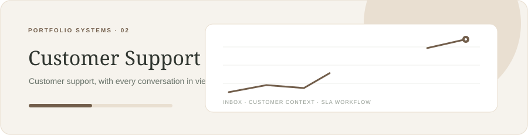

# Relay — Customer Support Inbox

**A shared inbox for thoughtful replies, clear ownership, and support teams that keep their promises.**

Next.js · Supabase · Resend · Tailwind CSS

## Product scope

Tenant-scoped ticket queue with assignment, SLA clocks, internal notes, and reply history.

## Architecture notes

Postgres with Supabase RLS; server-side Resend delivery; idempotent inbound messages; append-only ticket events.

### Data model sketch

    tickets(id, tenant_id, customer_id, assignee_id, status, priority, first_response_due_at) · messages(id, ticket_id, author_id, body, visibility, created_at)

## Stack

Next.js · Supabase · Resend · Tailwind CSS

## Build sequence

1. Inbox and ticket workflow
2. Tenant isolation and roles
3. Email send and reply threading
4. SLA policies and observability

## Current status

Public repository with an animated README. Product code is being built incrementally, one project at a time. This page records the planned product boundary and engineering milestones.

## License

MIT.
